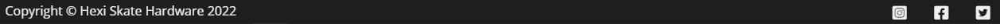

<h1 align="center">HeXi Skate Hardware Website</h1>

[View the live project here](https://https://thomasballardci.github.io/Hexi-Skate-HardwareM1/)

HeXi Skate Hardware is a site for a fictional company specialising in the design and making of 3D-printed inline skate hardware. The company sells custom design and print services to people who need a replacement part for their inline skates or who just want something different from stock. The site will be used to showcase to potential customers the types of products designed and used by existing customers and allow them to send in requests for products they may need via the contact form.

## Index – Table of Contents
* [User Experience (UX)](#user-experience-ux) 
* [Features](#features)
* [Design](#design)
* [Technologies Used](#technologies-used)
* [Testing](#testing)
* [Deployment](#deployment)
* [Credits](#credits)

## User Experience (UX)

-   ### User stories

    -   #### A. First Time Visitor Goals

        1. I want to easily understand what service the company provides.
        2. I want to be able to navigate throughout the site to find content I'm looking for.
        3. I want to be able to navigate to and view examples of the products available.
        4. I want to be able to easily find where I can contact the company and request their services.

    -   #### B. Returning Visitor Goals

        1. I want to be able to find updated examples of products they have produced.
        2. I want to be able to quickly and easily navigate to the relevant sections I need.
        3. I want to be able to contact the organisation to give feedback or ask questions.

    -   #### C. Frequent User Goals
        1. I want to be able to consistently view new and up-to-date designs and product imagery.
     

## Features

### Existing Features

-   __Navigation Bar__

    - The navigation bar has a consistent look and placement on all platforms and sections of the website to support easy navigation.  It includes a simple Logo to the left, Home, Gallery and Contact links to the right. The navigation bar is responsive on multiple screen sizes. When navigating around the site the active page will be displayed with a light blue underline along with a white underline when hovering over navigation links for each section. clicking or tapping the logo will also bring the user back to the main home section.

      
    

-   __Landing Page image, company name and design/enviroment descriptions__

    - The landing/home page includes a large image of a 3D printer on a stylistic background and large text to the right side with descriptive information on what the company does as well as the materials used. The bright purple colours and large font is intended to stand out and bring the users gaze down to the services and materials information whilst staying in line with the companies logo scheme.

      

- __Tagline__

    - The "3D PRINTED INLINE SKATE HARDWARE" tagline appears on the main page with inverted colors to stand out and let the user know exactly the services the company provides whilst keeping in theme to the company logo.

      

- __Gallery page__

    - The gallery page is to show large clear images of existing products the company has produced thus far. Hovering over the images on desktop platforms not only increases their size but also applying a bright blue border to make it easier for user to see the images clearly. On mobile and tablet platforms tapping the images provides the same bright border and size increase while staying responsive and resizing down to two columns on mobile platforms keeping images large and clear.
    
      

- __Contact Page__

    - The contact page is a large easy-to-read contact form consisting of first name, last name, email address, message box and a submit button. The contact form has a bright blue outline around each box to help the user identify the different sections along with placeholder text to show the user what information needs to be input into each section of the form. Every section is required to be populated to help the company easily identify the user and respond via email directly. The submit button has a bright purple coloring and highlights blue when hovered over to show the user they need to click to submit the information they provided. The information provided by the user is a bright purple keeping on the theme of the company's logo for the contact form as a whole. The large style of the contact form is responsive on each platform making is easy for the user to read and fill out.

      

- __Footer__

    - The footer bar sits at the end of the page sections at the bottom of the viewport. Holding copyright information on the left with social media icons for Hexi Skate Hardware's Instagram, Facebook and Twitter accounts on the right. The social media Icons highlight in blue when hovering over them and open the social media websites in separate tabs within the browser for the user to explore further. This coloring stays inline with the rest of the sites theme.

    
      

- __How these features support the User Stories__

    - The current features in the website help users achieve the user stories mentioned in the [User Experience (UX)](#user-experience-ux) part of this document. They are clear, themed and colored consistantly across the whole site and link to where the user wants to go whilst the information on the site is easily readable and to the point.

### Features which could be implemented in the future

- __Direct Ecommerce store page__
    - A 'Store' page could be added to provide an easier and more direct way for users to browse and purchase in house designed items that are not custom to the users needs.

- __Navigation bar improvements__
    - The navigation bar could be switched to a hamburger style icon to help save space when additional pages like the store are added on smaller devices such as tablet and mobile

- __Image rotator__
    - An image rotator on the main splash page to cycle through "featured" designs and items available would help users instantly see what's new.   

## Design

-   ### Imagery
    -   The hero and large background images have been chosen because they are eye-catching, fresh and bright.  The citrus and light pastel colours in the images were chosen to help convey a sense of energy, health and freshness.  The images depict fruit to align with the main business goal of selling juices and smoothies and were chosen for their "simplicity" (- e.g. a single type of fruit or repeating theme) to help keep the site clear and easy to use.

-   ### Colour Scheme
    -  A citrus/pastel palette was chosen to convey a fresh, energetic mood.  The colours picked were inspired by a palette from [Lily Bug Design](https://www.lilybugdesign.co.nz/colour-wall)

        

-   ### Typography
    -   Google Fonts were used to import Lato and Oswald fonts into styles.css.  These were chosen as they work well together and have a simple, unembellished, modern feel that is easy to read.

-   ### Wireframes

    -   #### Main Page Wireframes

        

    -   #### Menu Page Wireframes

        

    -   #### Contact Page Wireframes

        

## Technologies Used

### Languages Used

-   [HTML5](https://en.wikipedia.org/wiki/HTML5)
-   [CSS3](https://en.wikipedia.org/wiki/Cascading_Style_Sheets)

### Frameworks, Libraries & Programs Used

-   [Google Fonts:](https://fonts.google.com/) was used to import the 'Lato' and 'Oswald' fonts into the style.css file which are used on all pages of the project.
-   [Font Awesome:](https://fontawesome.com/) was used to add icons for aesthetic and UX purposes.
-   [Git:](https://git-scm.com/) was used for version control by utilising the Gitpod terminal to commit to Git and Push to GitHub.
-   [GitHub:](https://github.com/) is used as the respository for the projects code after being pushed from Git.
-   [Microsoft Paint 3D:](https://www.microsoft.com/en-us/p/paint-3d/9nblggh5fv99?activetab=pivot:overviewtab) was used for resizing images and editing photos for the website.
-   [Balsamiq:](https://balsamiq.com/) was used to create the wireframes during the design process.
    

## Testing

### Validator Testing

- [HTML Validator](https://validator.w3.org/)

    - result for index.html
      
    - result for menu.html
      
    - result for contact.html
      

    - Full validation results are available on github here :

        - <a href="https://github.com/elainebroche-dev/ms1-thrive/blob/master/documentation/validation-results/html-validation-results-index.pdf" target="_blank">HTML Results - Home Page</a>

        - <a href="https://github.com/elainebroche-dev/ms1-thrive/blob/master/documentation/validation-results/html-validation-results-menu.pdf" target="_blank">HTML Results - Menu Page</a>

        - <a href="https://github.com/elainebroche-dev/ms1-thrive/blob/master/documentation/validation-results/html-validation-results-contact.pdf" target="_blank">HTML Results - Contact Page</a>

- [CSS Validator](https://jigsaw.w3.org/css-validator/)

    - result for styles.css 
      
      

      The warnings are due to 1) import of the Google fonts and 2) a webkit extension for Safari support of the flip-card effect used on the home page.

    - Full validation results are available on github here :

        - <a href="https://github.com/elainebroche-dev/ms1-thrive/blob/master/documentation/validation-results/css-validation-results.pdf" target="_blank">CSS Results - styles.css</a>

### Browser Compatibility

- Testing has been carried out on the following browsers :
    - Chrome Version 90.0.4430.212 (Official Build) (64-bit)
    - Firefox Version 88.0.1 (64-bit)
    - Edge Version 90.0.818.62 (Official build) (64-bit)
    - Safari on macOS Catalina (Safari  Version 14.0.3)
    
### Test Cases and Results

- The below table details the test cases that were used, the results and a cross-reference to the Feature ID that each test case exercised (click to open iamge):

  

### Known bugs

- My mentor reported an issue with the "Send Message" button when viewed on an iphone during a review meeting.  Neither of us has since been able to re-create this using the browser dev tools but I am adding an image of the issue here for completeness :

  

## Deployment

### How this site was deployed

- In the GitHub repository, navigate to the Settings tab, then choose Pages from the left hand menu 
- From the source section drop-down menu, select the Master Branch
- Once the master branch has been selected, the page will be automatically refreshed with a detailed ribbon display to indicate the successful deployment
- Any changes pushed to the master branch will take effect on the live project

  The live link can be found here - [THRIVE Juices and Smoothies](https://elainebroche-dev.github.io/ms1-thrive/index.html) 

### How to clone the repository

- Go to the https://github.com/elainebroche-dev/ms1-thrive repository on GitHub 
- Click the "Code" button to the right of the screen, click HTTPs and copy the link there
- Open a GitBash terminal and navigate to the directory where you want to locate the clone
- On the command line, type "git clone" then paste in the copied url and press the Enter key to begin the clone process
 
## Credits 

### Content 
- Content on the menu page was loosely based on menus on [Jump Juice Bar](https://www.jumpjuicebar.com/menu-nutrition-smoothies/)
- All other content was written by the developer

### Code
- Code on how to do the fade-in of the hero image came from information on this page : [CSS Image fade-in tutorial](https://blog.hubspot.com/website/css-fade-in)
- Code on how to do a rounded button as seen on the Home page was based on code on : [W3Schools Rounded button tutorial](https://www.w3schools.com/howto/howto_css_round_buttons.asp)
- Code on how to do the flip-card effect on the Home page was based on example code on : [W3Schools Flip card tutorial](https://www.w3schools.com/howto/howto_css_flip_card.asp)
- Code on how to include google map with marker was based on code from this site :  [How to embed Google Map](https://www.maps.ie/create-google-map/)
- Code on how to implement flex boxes was based on instructions from [YouTube Flexbox Tutorial](https://www.youtube.com/watch?v=S0a7PEOi0do)

### Media 
- The colours used were based on a citrus/pastel palette from this website : [Lily Bug Design - Colour Wall](https://www.lilybugdesign.co.nz/colour-wall) 
- The icons in the header, footer and on the back of the flip-cards were taken from [Font Awesome](https://fontawesome.com/)
- The fonts used were imported from [Google Fonts](https://fonts.google.com/)

- All images were downloaded from [Unsplash](https://unsplash.com) :

    - <a href="https://images.unsplash.com/photo-1546548970-71785318a17b?ixid=MnwxMjA3fDB8MHxwaG90by1wYWdlfHx8fGVufDB8fHx8&ixlib=rb-1.2.1&auto=format&fit=crop&w=334&q=80">Main (hero/landing) image and background image</a> photo by <a href="https://unsplash.com/@brunabranco?utm_source=unsplash&utm_medium=referral&utm_content=creditCopyText">Bruna Branco</a> 

    - <a href="https://unsplash.com/photos/9aOswReDKPo?utm_source=unsplash&utm_medium=referral&utm_content=creditShareLink" target="_blank" rel="noopener">Avocado</a> photo by <a href="https://unsplash.com/@thoughtcatalog?utm_source=unsplash&utm_medium=referral&utm_content=creditCopyText" target="_blank" rel="noopener">Thought Catalog</a>

    - <a href="https://images.unsplash.com/photo-1595475207225-428b62bda831?ixid=MnwxMjA3fDB8MHxwaG90by1wYWdlfHx8fGVufDB8fHx8&ixlib=rb-1.2.1&auto=format&fit=crop&w=500&q=80" target="_blank" rel="noopener">Watermelon</a> photo by <a href="https://unsplash.com/@amyshamblen?utm_source=unsplash&utm_medium=referral&utm_content=creditCopyText" target="_blank" rel="noopener">Amy Shamblen</a> 

    - <a href="https://images.unsplash.com/photo-1564769610726-59cead6a6f8f?ixid=MnwxMjA3fDB8MHxwaG90by1wYWdlfHx8fGVufDB8fHx8&ixlib=rb-1.2.1&auto=format&fit=crop&w=448&q=80" target="_blank" rel="noopener">Sliced oranges</a> photo by <a href="https://unsplash.com/@euniquedeeann?utm_source=unsplash&utm_medium=referral&utm_content=creditCopyText" target="_blank" rel="noopener">Eunique Deeann</a> 

    - <a href="https://images.unsplash.com/photo-1559181567-c3190ca9959b?ixlib=rb-1.2.1&ixid=MnwxMjA3fDB8MHxwaG90by1wYWdlfHx8fGVufDB8fHx8&auto=format&fit=crop&w=400&q=80" target="_blank" rel="noopener">Cherries</a> photo by <a href="https://unsplash.com/@picoftasty?utm_source=unsplash&utm_medium=referral&utm_content=creditCopyText" target="_blank" rel="noopener">Mae Mu</a> 

### Acknowledgments

- Thank you to my mentor Brian Macharia who gave me very good advice and feedback on how to plan and execute this project and who provided me with lots of pointers on resources to help select colours and images and well as resources to help with coding and testing.
