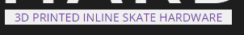

<h1 align="center">HeXi Skate Hardware Website</h1>

[View the live project here](https://thomasballardci.github.io/Hexi-Skate-HardwareM1/)

HeXi Skate Hardware is a site for a fictional company specialising in the design and making of 3D-printed inline skate hardware. The company sells custom design and print services to people who need a replacement part for their inline skates or who just want something different from stock. The site will be used to showcase to potential customers the types of products designed and used by existing customers and allow them to send in requests for products they may need via the contact form.

## Index – Table of Contents
* [User Experience (UX)](#user-experience-ux) 
* [Features](#features)
* [Design](#design)
* [Technologies Used](#technologies-used)
* [Testing](#testing)
* [Deployment](#deployment)
* [Credits](#credits)

## User Experience (UX)

-   ### User stories

    -   #### A. First-Time Visitor Goals

        1. I want to easily understand what service the company provides.
        2. I want to be able to navigate throughout the site to find the content I'm looking for.
        3. I want to be able to navigate to and view examples of the products available.
        4. I want to be able to easily find where I can contact the company and request their services.

    -   #### B. Returning Visitor Goals

        1. I want to be able to find updated examples of products they have produced.
        2. I want to be able to quickly and easily navigate to the relevant sections I need.
        3. I want to be able to contact the organisation to give feedback or ask questions.

    -   #### C. Frequent User Goals
        1. I want to be able to consistently view new and up-to-date designs and product imagery.
     

## Features

### Existing Features

-   __Navigation Bar__

    - The navigation bar has a consistent look and placement on all platforms and sections of the website to support easy navigation.  It includes a simple Logo to the left, Home, Gallery and Contact links to the right. The navigation bar is responsive on multiple screen sizes. When navigating around the site the active page will be displayed with a light blue underline along with a white underline when hovering over navigation links for each section. clicking or tapping the logo will also bring the user back to the main home section.

      
    

-   __Landing Page image, company name and design/environment descriptions__

    - The landing/home page includes a large image of a 3D printer on a stylistic background and large text to the right side with descriptive information on what the company does as well as the materials used. The bright purple colours and large font is intended to stand out and bring the user's gaze down to the services and materials information whilst staying in line with the company's logo scheme.

      

- __Tagline__

    - The "3D PRINTED INLINE SKATE HARDWARE" tagline appears on the main page with inverted colours to stand out and let the user know exactly the services the company provides whilst keeping in theme to the company logo.

      

- __Gallery page__

    - The gallery page is to show large clear images of existing products the company has produced thus far. Hovering over the images on desktop platforms not only increases their size but also applies a bright blue border to make it easier for the user to see the images clearly. On mobile and tablet platforms tapping the images provides the same bright border and size increase while staying responsive and resizing down to two columns on mobile platforms keeping images large and clear.
    
      

- __Contact Page__

    - The contact page is a large easy-to-read contact form consisting of first name, last name, email address, message box and a submit button. The contact form has a bright blue outline around each box to help the user identify the different sections along with placeholder text to show the user what information needs to be input into each section of the form. Every section is required to be populated to help the company easily identify the user and respond via email directly. The submit button has a bright purple colouring and highlights blue when hovered over to show the user they need to click to submit the information they provided. The information provided by the user is a bright purple keeping on the theme of the company's logo for the contact form as a whole. The large style of the contact form is responsive on each platform making it easy for the user to read and fill out.

      

- __Footer__

    - The footer bar sits at the end of the page sections at the bottom of the viewport. Holding copyright information on the left with social media icons for Hexi Skate Hardware's Instagram, Facebook and Twitter account on the right. The social media Icons highlight in blue when hovering over them and open the social media websites in separate tabs within the browser for the user to explore further. This colouring stays in line with the rest of the site's theme.

    
      

- __How these features support the User Stories__

    - The current features in the website help users achieve the user stories mentioned in the [User Experience (UX)](#user-experience-ux) part of this document. They are clear, themed and coloured consistently across the whole site and link to where the user wants to go whilst the information on the site is easily readable and to the point.

### Features which could be implemented in the future

- __Direct eCommerce store page__
    - A 'Store' page could be added to provide an easier and more direct way for users to browse and purchase in-house designed items that are not custom to the user's needs.

- __Navigation bar improvements__
    - The navigation bar could be switched to a hamburger-style icon to help save space when additional pages like the store are added on smaller devices such as tablets and mobile

- __Image rotator__
    - An image rotator on the main splash page to cycle through "featured" designs and items available would help users instantly see what's new.   

## Design

-   ### Website style
    - The style of the website chosen was a single-page format. This allows the user to not only navigate to each section from the nav bar but also scroll through the entire website at their leisure.

-   ### Imagery
    -  The large and bright 3D Printer image has been chosen because it is eye-catching and bright this draws the user's line of sight and shows the user the technologies used. The Purple and light colours in the image background were chosen to help convey a parody of the company's logo. The Large bright purple font takes the user's eyes naturally across the screen and guides them down to the information about what the company does and the materials they use.

-   ### Colour Scheme
    -  A light airy and modern colour scheme is used to keep parody with the company's existing logo colour scheme. Utilising a dark background for the website helps the content "pop" making it easier on the eyes than a white background, whilst providing a contrast with the website content to help keep readability high.

        

-   ### Typography
    -   Google Fonts were used to import Open Sans and sans-serif fonts into styles.css.  These were chosen as they work well together and have a simple, unembellished, modern feel that is easy to read.

-   ### Wireframes

    -   #### All Wireframes

        

    -   #### Desktop platform Wireframes

        

    -   #### Tablet platform Wireframes

        

    -   #### Mobile platform Wireframes

        

## Technologies Used

### Languages Used

-   [HTML5](https://en.wikipedia.org/wiki/HTML5)
-   [CSS3](https://en.wikipedia.org/wiki/Cascading_Style_Sheets)
-   [Java Script](https://en.wikipedia.org/wiki/JavaScript)

### Frameworks, Libraries & Programs Used

-   [Google Fonts:](https://www.fonts.google.com/) was used to import the 'Open Sans' font into the style.css file which is used on all pages of the project.
-   [Font Awesome:](https://www.fontawesome.com/) was used to add icons for aesthetic and UX purposes on the main page and footer.
-   [Gitpod:](https//www.Gitpod.io) was used for version control and as a VSCode workspace to code, commit and Push to GitHub.
-   [GitHub:](https://www.github.com/) is used as the repository for the project's code after being pushed from Gitpod.
-   [AnyWebP](https://www.anywebp.com/convert-to-webp.html) was used to convert and compress images used on the website
-   [Adobe XD](https://www.adobe.com/creativecloud.html) was used to create the wireframes during the design process.
-   [Adobe Photoshop](https://www.adobe.com/creativecloud.html) was used to create the 3D printer image on the main page.
    

## Testing

### Validator Testing

- [HTML Validator](https://validator.w3.org/)

    - Result for index.html (whole single-page website)

      

- [CSS Validator](https://jigsaw.w3.org/css-validator/)

    - Result for my style.css

      

    - Result for website CSS

      
    The warnings seem to be due to the import of the Font awesome icons.

- [Light House Validation](https://developer.chrome.com/docs/lighthouse/overview/)

    - Result for desktop

      

    - Result for Mobile

        

### Browser Compatibility

- Testing has been carried out on the following browsers :
    - Chrome Version Version 108.0.5359.99 (Official Build) (64-bit)
    - Firefox Version 88.0.1 (64-bit)
    - Microsoft Edge Version 108.0.1462.46 (Official Build) (64-bit)
    - Safari on macOS Catalina (Safari  Version 16.2)
    
### Test Cases and Results

- To completely test the website I performed the following manual testing on the various browsers mentioned above and devices (windows desktop, Samsung Galaxy S20+, iPhone). 

  I also went through the website using Chromes developer tools to  ensure the site was responsive and aligned correctly on 
smaller desktops (laptops), tablets and mobile devices.

_Nav bar testing_

- Test each link on the nav bar. Each link took me to the relevant section required, the Logo took me home as expected. The nav bar stayed in place when scrolling ensuring the user has access to navigation at all times. Nav "active" page effect works as expected when clicking between pages and underlines blue.

_Footer testing_

- Test each social media Icon. Each social media icon link opened the relevant social media website in a new tab as expected when clicked. Footer behaved how I expected appearing at the bottom of the site when the user scrolls or navigates down to the last section (Contact).

_Nav and footer hover effects testing_

- Test the expected result of the hover effect on the nav links (Home, Gallery, Contact) as well as the social media icon links on the footer. All nav links and social media icons behaved as expected when hovering over with the mouse, Nav links were underlined white and the social icons lit up blue as expected

_Gallery image hover testing_

- Test the expected result of the hover effect on the Gallery images. All images behaved as expected when hovering over them with the mouse. All images increased in scale by 10% when hovering.

### Known bugs

- Nav bar doesn't update when scrolling between the sections of the webpage when moving down. This requires Java Script from what I could find out and the code examples found I couldn't get working and had to drop the idea due to time constraints and a lack of JavaScript knowledge.

## Deployment

### How this site was deployed

- In the GitHub repository, navigate to the Settings tab, then choose Pages from the left-hand menu.
- From the source section drop-down menu, select the "Deploy from a branch" option.
- From the "Branch" section below the previous source drop-down select "Main" from the left drop-down list and "/(root)" from the right drop-down and click "save".
- Once the "Main" branch and "/(root)" have been selected, the page will be automatically refreshed with a detailed ribbon display to indicate the successful deployment with a link appearing at the top of the "GitHub Pages" section along with a "visit site" button to the right. Clicking the button will take you to the deployed website.
- Any changes pushed to the "Main" branch will take effect on the live project.

  The live link can be found here - [HeXi Skate Hardware](https://thomasballardci.github.io/Hexi-Skate-HardwareM1//index.html) 

### How to clone the repository

- Go to the https://github.com/ThomasBallardCI/Hexi-Skate-HardwareM1 repository on GitHub 
- Click the "Code" button to the right of the screen, click HTTPS and copy the link there
- Open a GitBash terminal and navigate to the directory where you want to locate the clone
- On the command line, type "git clone" then paste in the copied URL and press the Enter key to begin the cloning process

    Documentation on cloning the repository can be found here - [GitHub Cloning a repository](https://docs.github.com/en/repositories/creating-and-managing-repositories/cloning-a-repository)
 
## Credits 

### Code
- Initial HTML structuring was inspired by the Love Running Project from Code Insitute in the CSS essentials module.

- Information on understanding flexbox to display: flex .content-container was taken from : [CSS Tricks a guide to flexbox](https://css-tricks.com/snippets/css/a-guide-to-flexbox/)

- Sticky header was done on advice from the Code Institute tutor.

- Code on how to set the "active" page on the header when clicking the link between sections using Java Script was on advice from Code Insitute tutor and taken from W3Schools and adjusted for my needs : [W3Schools How to JS active Element](https://www.w3schools.com/howto/howto_js_active_element.asp)

- Contact form used from W3Schools and adjusted to fit my needs and colour theme from here : [W3Shools How to CSS Contact form](https://www.w3schools.com/howto/howto_css_contact_form.asp)

### Media 
- The colours used were based on the original logo design I created that is displayed in the header. 

- The icons in the footer and Main page are taken from : [Font Awesome](https://fontawesome.com/)

- The fonts used were imported from [Google Fonts](https://fonts.google.com/)

- All gallery images were taken from my Instagram account : [Instagram](https://www.instagram.com/hexiskatehardware/)

- 3D Printer image on the main page taken from StickPNG and edited background myself in photoshop : [StickPNG 3D Printer](https://www.stickpng.com/img/electronics/3d-printers/mankati-3d-printer)

### Acknowledgments

- Thank you to Code institute student support tutors for their direction and help in understanding issues I had and my fellow South Staffs September 2022 group members for helping with testing.

- Thank you to my mentor Elaine Roche for the help and template of this README.md
